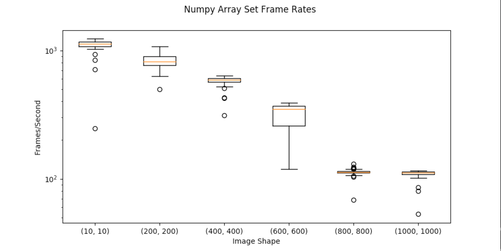
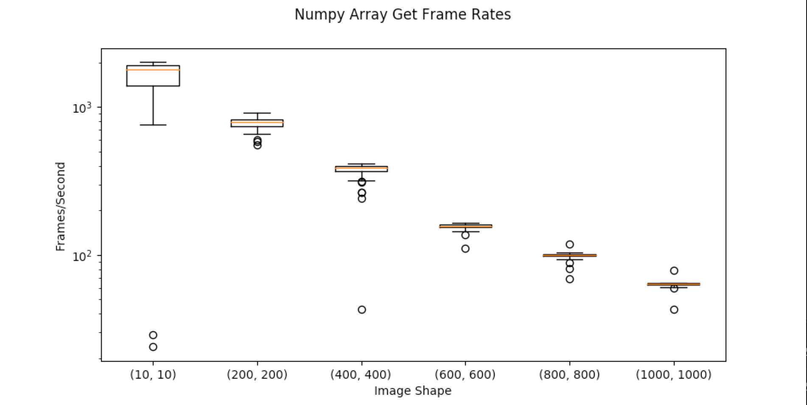

Performance
===============
The below documents REEM Performance. See the
`the repository <https://github.com/tn74/reem/blob/master/tests/reem_performance_measurement.py>`_ for the full
source code and more information.

Data Transfer Rates
#####################

Both the database and pubsub paradigms use the same methods for data transfer. The below tests apply to both
even though it was conducted in the database paradigm.

Number of Entries vs Latency
^^^^^^^^^^^^^^^^^^^^^^^^^^^^^^^^^^^^^^

String Data
------------

In the below test, a dictionary with X string entries was written to Redis. One hundred trials were conducted.
The box-plots of their latency is below. Latency grows linearly with the amount of data sent. The source code
to generate this plot is below.

.. image:: _static/set_string.png

.. literalinclude:: ../tests/reem_performance_measurement.py
    :lines: 39-49

Numpy Data
------------

In the below test, a dictionary with X numpy array entries was written to Redis. One hundred trials were conducted.
The box-plots of their latency is below. Latency grows linearly with the amount of data sent. The source code
to generate this plot is below.

.. image:: _static/set_numpy.png

.. literalinclude:: ../tests/reem_performance_measurement.py
    :lines: 52-62

Numpy Array Size Throughput
^^^^^^^^^^^^^^^^^^^^^^^^^^^^^

Set
----------

A numpy array of size (N x N) was uploaded to the server as fast as possible. Frame rates are shown below

.. literalinclude:: ../tests/reem_performance_measurement.py
    :lines: 84-96

Get
----------

A numpy array of size (N x N) was downloaded from the server as fast as possible. Frame rates are shown below

.. literalinclude:: ../tests/reem_performance_measurement.py
    :lines: 97-110

Subscriber Overhead
########################

The below code tested what the overhead was with having multiple subscribers to a given channel. The publisher
and each subscriber was run in it's own process on the same machine.
A publisher uploaded a timestamp and subscribers calculated the difference between the timestamp and the time they
read the image.

.. image:: _static/subscriber_oh.png

.. literalinclude:: ../tests/reem_performance_measurement.py
    :lines: 169-248

Comparison
#################
There exist other packages that provide similar but not identical functionality to REEM.

Potteryx
^^^^^^^^^

The package `potteryx <https://github.com/brainix/pottery>`_ offers pythonic ways of using Redis data types.
It's implementation of a python dictionary for JSON-compatible data is faster than REEM.

.. image:: _static/reem_v_pottery.png

The comparison was generated with the following code:

.. literalinclude:: ../tests/reem_performance_measurement.py
    :lines: 252-290

Pottery does not use ReJSON. To store nested data, ``potteryx`` serializes data deeper than one level inside a
Python dictionary to JSON. The JSON is then stored as a subkey of Redis Hash.

Pottery will require some extra work to get non-serializable data like numpy arrays to work with it.

REEM could potentially use Pottery in the future. Thoughts for a future implementation

1. Need to understand how to convert encode/decode non-serializable data types to be JSON compatible
2. Edit the Reader and Writer classes to use ``potteryx``
